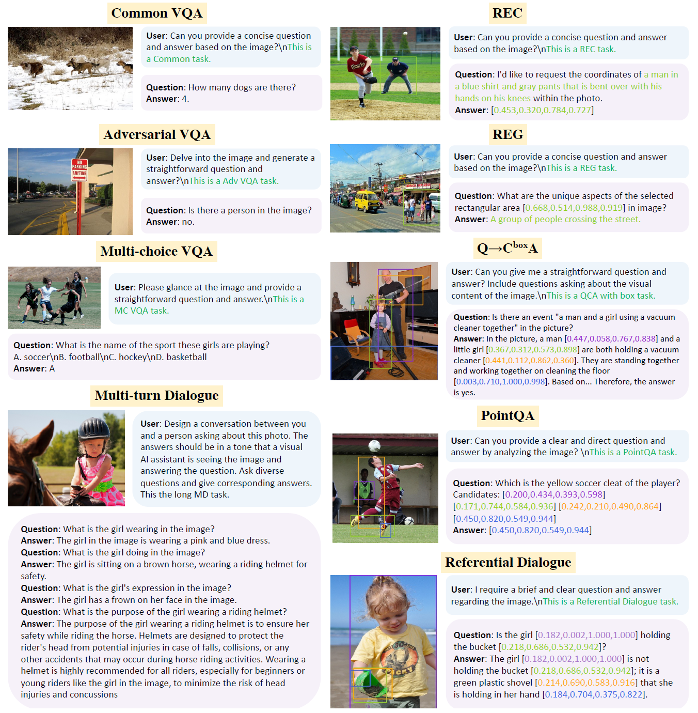

#  Empowering Multimodal Large Language Model as a Powerful Data Generator

*An Automatic multimodal instruction tuning data generation pipeline.*


## Overview

<p align="center">
    </a>
</p>

💡Key Contributions:
* **Pipeline** - We introduce an innovative multimodal data generation pipeline, Genixer, that inlcudes four steps: Instruction Data Collection, Instruction Template Design, Training MLLMs and Data Generation & Filtering. 
* **Two Data Generators** - $\text{Genixer}_L$ and $\text{Genixer}_S$.
* **Two Synthetic Datasets** - [915K VQA-like data](https://huggingface.co/datasets/Anonymous-G/GenixerforLLaVA-Datasets) and [350K REC-like data](https://huggingface.co/datasets/Anonymous-G/GenixerForShikra-Datasets). 


**Usage and License Notices**: The data, and code is intended and licensed for research use only. They are also restricted to uses that follow the license agreement of LLaMA, Vicuna. The dataset is CC BY NC 4.0 (allowing only non-commercial use) and models trained using the dataset should not be used outside of research purposes. 

## Genixer Pipeline

Genixer contains four key steps, including 1) instruction data collection, 2) instruction template design, 3) empowering current MLLMs, and 4) data generation and filtering.

<p align="center"></p>

## Instruction Data Collection

In accordance with the prevalence and practical relevance of real-world multi-modal tasks, we have carefully selected 9 representative multimodal tasks as listed in the following table for corresponding data generation. We categorize the VL tasks into two types: 4 Generic tasks and 5 grounding tasks.

<p align="center">
    </a> <br>
    Overview of collected data for training two data generators.
</p>

## Data Filtering

<p align="center">
    </a> <br>
    The illustration of proposed Fuyu-driven data filtering framework. The outputs of the framework compose a probability and a direct answer.
</p>

## Results

<p align="center">
    </a> <br>
    Comparison with SoTA methods on 12 benchmarks.
</p>


## 🧸 Samples of Generated Data

<p align="center">
    </a> <br>
    Selected examples generated from $\text{Genixer}_L$ and $\text{Genixer}_S$. The examples include Common VQA, Adv VQA, MC VQA, MD, and five grounding tasks.
</p>


## Genixer with LLaVA

### Install

```Shell
conda create -n llava python=3.10 -y
conda activate llava
pip install --upgrade pip
pip install -e .
```

### Model Weights

### Data Preparation

### Synthetic Data Download

### Training

### Evaluation

## Genixer with Shikra


## Citation

If you find Ferret useful, please cite using this BibTeX:

```bibtex
@article{zhao2023genixer,
  title={Genixer: Empowering Multimodal Large Language Models as a Powerful Data Generator},
  author={Zhao, Henry Hengyuan and Zhou, Pan and Shou, Mike Zheng},
  journal={arXiv preprint arXiv:2312.06731},
  year={2023}
}
```

## Acknowledgement

- [LLaVA](https://github.com/haotian-liu/LLaVA): the codebase we built upon. 
- [Shikra](https://github.com/shikras/shikra): the codebase we built upon. 