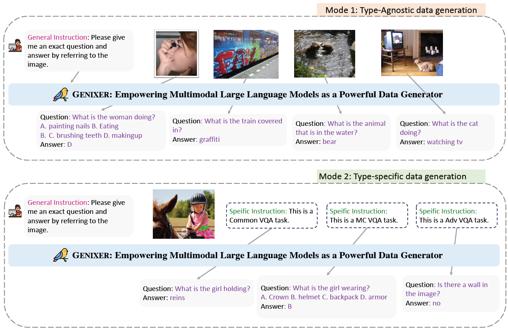
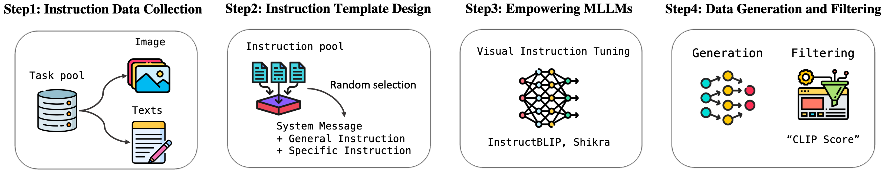
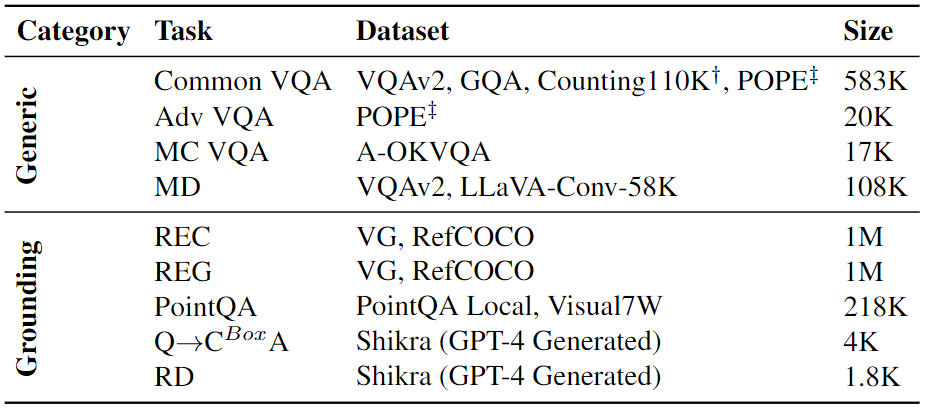
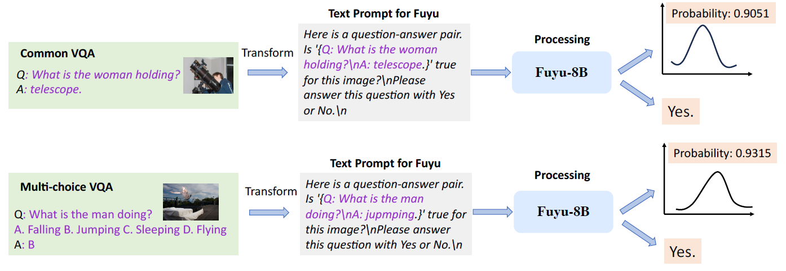
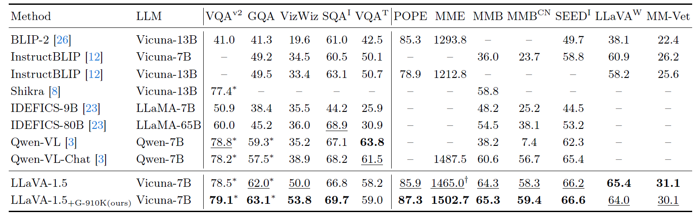

<div style="text-align: center; display: inline-block">
  
  <h2 style="display: inline-block; vertical-align: middle; margin-left: 10px;">
    Genixer: Empowering Multimodal Large Language Model as a Powerful Data Generator
  </h2>
</div>

<p align="Center">
    <a href="https://scholar.google.com/citations?user=QLSk-6IAAAAJ&hl=zh-CN"><strong>Henry Hengyuan Zhao</strong></a>
    ·
    <a href="https://panzhous.github.io/"><strong>Pan Zhou</strong></a>
    ·
    <a href="https://sites.google.com/view/showlab"><strong>Mike Zheng Shou</strong></a>
    <br>
    <br>
        <a href="https://arxiv.org/abs/2312.06731"></a>
        <a href='https://github.com/zhaohengyuan1/Genixer'></a>
        <a href='https://huggingface.co/Anonymous-G'></a>
    <br>
    <b>Show Lab, National University of Singapore &nbsp; | &nbsp; Singapore Management University </b>
  </p>

## Overview

<p align="center">
    </a>
</p>

## 💡Key Contributions:

* **Pipeline** - We introduce an innovative multimodal data generation pipeline, Genixer, that inlcudes four steps: Instruction Data Collection, Instruction Template Design, Training MLLMs and Data Generation & Filtering. 
* **Two Data Generators** - $\text{Genixer}_L$ and $\text{Genixer}_S$.
* **Two Synthetic Datasets** - [915K VQA-like data](https://huggingface.co/datasets/Anonymous-G/GenixerforLLaVA-Datasets) and [350K REC-like data](https://huggingface.co/datasets/Anonymous-G/GenixerForShikra-Datasets). 


**Usage and License Notices**: The data, and code is intended and licensed for research use only. They are also restricted to uses that follow the license agreement of LLaMA, Vicuna. The dataset is CC BY NC 4.0 (allowing only non-commercial use) and models trained using the dataset should not be used outside of research purposes. 

## Genixer Pipeline

Genixer contains four key steps, including 1) instruction data collection, 2) instruction template design, 3) empowering current MLLMs, and 4) data generation and filtering.

<p align="center"></p>

## Instruction Data Collection

In accordance with the prevalence and practical relevance of real-world multi-modal tasks, we have carefully selected 9 representative multimodal tasks as listed in the following table for corresponding data generation. We categorize the VL tasks into two types: 4 Generic tasks and 5 grounding tasks.

<p align="center">
    
    <br>
    Overview of collected data for training two data generators.
</p>

## Data Filtering

<p align="center">
    
    <br>
    The illustration of proposed Fuyu-driven data filtering framework. The outputs of the framework compose a probability and a direct answer.
</p>

## Results

<p align="center">
     
    <br>
    Comparison with SoTA methods on 12 benchmarks.
</p>


## 🧸 Samples of Generated Data

<p align="center">
     <br>
    Selected examples generated from $\text{Genixer}_L$ and $\text{Genixer}_S$. The examples include Common VQA, Adv VQA, MC VQA, MD, and five grounding tasks.
</p>

## 58 Handwritten Generic Instructions

For the generic instructions used in training Genixer, please refer to the path `Genixer_Shikra/config/_base_/dataset/template/GenQA_general_instructions.json` for the details.


## Genixer with LLaVA

### Install


```Shell
cd Genixer_LLaVA
conda create -n genixerL python=3.10 -y
conda activate genixerL
pip install --upgrade pip
pip install -e .
```

### Model Weights

| Model Name | Checkpoints|
|----------|---------------|
|Genixer-llava-v1.5-7b| [Model weights](https://huggingface.co/Anonymous-G/Genixer-llava-v1.5-7b) |
|llava-Genixer-915K-FT-8K-v1.5-7b | [Model weights](https://huggingface.co/Anonymous-G/llava-Genixer-915K-FT-8K-v1.5-7b) |


### Image Datasets

Please download the images from constituting datasets:

- COCO: [train2014](http://images.cocodataset.org/zips/train2014.zip)
- GQA: [images](https://downloads.cs.stanford.edu/nlp/data/gqa/images.zip)
- OCR-VQA: [download script](https://drive.google.com/drive/folders/1_GYPY5UkUy7HIcR0zq3ZCFgeZN7BAfm_?usp=sharing), **we save all files as `.jpg`**
- AOKVQA: [download script](https://github.com/allenai/aokvqa?tab=readme-ov-file#downloading-the-dataset)
- TextVQA: [train_val_images](https://dl.fbaipublicfiles.com/textvqa/images/train_val_images.zip)
- VisualGenome: [part1](https://cs.stanford.edu/people/rak248/VG_100K_2/images.zip), [part2](https://cs.stanford.edu/people/rak248/VG_100K_2/images2.zip)
- LLaVA-CC3M-Pretrain-595K: [huggingface](https://huggingface.co/datasets/liuhaotian/LLaVA-CC3M-Pretrain-595K)
- LLaVA-Pretrain: [huggingface](https://huggingface.co/datasets/liuhaotian/LLaVA-Pretrain)
- LLaVA-Instruct: [huggingface](https://huggingface.co/datasets/liuhaotian/LLaVA-Instruct-150K)
- Flickr30K: [Kaggle](https://www.kaggle.com/datasets/adityajn105/flickr30k)

<!-- [llava_v1_5_mix665k.json](https://huggingface.co/datasets/liuhaotian/LLaVA-Instruct-150K/blob/main/llava_v1_5_mix665k.json): 665K instruction tuning data from original LLaVA1.5. -->

### Training data for $\text{Genixer}_L$

[TrainDataforGenixerLLaVA.jsonl](https://huggingface.co/datasets/Anonymous-G/GenixerforLLaVA-Datasets/blob/main/TrainDataforGenixerLLaVA.jsonl): 1M instruction tuning data for training the $\text{Genixer}_L$ with the capability of generating diverse data types.

### Synthetic Data

[Genixer_915K.jsonl](https://huggingface.co/datasets/Anonymous-G/GenixerforLLaVA-Datasets/blob/main/Genixer_915K.jsonl): This is the synthetic instruction tuning data generated by our trained $\text{Genixer}_L$.

Moreover, we provide additional two synthetic pretraining datasets mentioned in ablation study for your preference:

[Genixer_300K.jsonl](https://huggingface.co/datasets/Anonymous-G/GenixerforLLaVA-Datasets/blob/main/Genixer_300K.jsonl)

[Genixer_610K.jsonl](https://huggingface.co/datasets/Anonymous-G/GenixerforLLaVA-Datasets/blob/main/Genixer_610K.jsonl)

### Evaluation for $\text{Genixer}_L$
1. Download model weight [Genixer-llava-v1.5-7b](https://huggingface.co/Anonymous-G/Genixer-llava-v1.5-7b) under the folder `checkpoints`.
2. Run evaluation on Flickr30K unannotated images with generic data type, please refer to the script `scripts/eval_genixer/generic_generation.sh`.

```shell
CHUNKS=8
CKPT=Genixer-llava-v1.5-7b

qfile=data/flickr30k_imagequery.jsonl
imgdir=/yourpath/flickr30k/flickr30k_images/flickr30k_images
datatype=flickr30k_tem0.2
tasktype=generic

for IDX in $(seq 0 $((CHUNKS-1))); do
    CUDA_VISIBLE_DEVICES=$IDX python -m model_genixer_eval \
        --model-path checkpoints/$CKPT \
        --question-file $qfile \
        --image-folder $imgdir \
        --answers-file ./playground/data/genixer_eval/$datatype/$tasktype/answers/$CKPT/${CHUNKS}_${IDX}.jsonl \
        --task-type $tasktype \
        --num-chunks $CHUNKS \
        --chunk-idx $IDX \
        --temperature 0.2 \
        --conv-mode vicuna_v1 &
done

wait

output_file=./playground/data/genixer_eval/$datatype/$tasktype/answers/$CKPT/merge.jsonl
> "$output_file"

for IDX in $(seq 0 $((CHUNKS-1))); do
    cat ./playground/data/genixer_eval/$datatype/$tasktype/answers/$CKPT/${CHUNKS}_${IDX}.jsonl >> "$output_file"
done
```

More evaluation scripts can be found in `scripts/eval_genixer`.

### Training for $\text{Genixer}_L$

1. Download the model weight [clip-vit-large-patch14-336](https://huggingface.co/openai/clip-vit-large-patch14-336) under the folder `checkpoints`.

2. Download the model weight [llava-v1.5-7b](https://huggingface.co/liuhaotian/llava-v1.5-7b) under the folder `checkpoints`.

3. Preparing the [TrainDataforGenixerLLaVA.jsonl](https://huggingface.co/datasets/Anonymous-G/GenixerforLLaVA-Datasets/blob/main/TrainDataforGenixerLLaVA.jsonl) under the folder `data`.

4. Run the training script ```bash scripts/train_genixer.sh```
```shell
#!/bin/bash
outputdir=exp/llava-v1.5-7b-Genixer

deepspeed llava/train/train_mem.py \
    --deepspeed ./scripts/zero3.json \
    --model_name_or_path checkpoints/llava-v1.5-7b \
    --version v1 \
    --data_path ./data/TrainDataforGenixerLLaVA.jsonl \
    --image_folder ./data \
    --vision_tower checkpoints/clip-vit-large-patch14-336 \
    --mm_projector_type mlp2x_gelu \
    --mm_vision_select_layer -2 \
    --mm_use_im_start_end False \
    --mm_use_im_patch_token False \
    --image_aspect_ratio pad \
    --group_by_modality_length True \
    --bf16 True \
    --output_dir $outputdir \
    --num_train_epochs 1 \
    --per_device_train_batch_size 8 \
    --per_device_eval_batch_size 4 \
    --gradient_accumulation_steps 2 \
    --evaluation_strategy "no" \
    --save_strategy "steps" \
    --save_steps 50000 \
    --save_total_limit 1 \
    --learning_rate 1e-5 \
    --weight_decay 0. \
    --warmup_ratio 0.03 \
    --lr_scheduler_type "cosine" \
    --logging_steps 1 \
    --tf32 True \
    --model_max_length 2048 \
    --gradient_checkpointing True \
    --dataloader_num_workers 4 \
    --lazy_preprocess True \
    --report_to wandb
```

### Training LLaVA1.5 with 915K synthetic data

1. Download the model weight [clip-vit-large-patch14-336](https://huggingface.co/openai/clip-vit-large-patch14-336) under the folder `checkpoints`.

2. Download the model weight [vicuna-7b-v1.5](https://huggingface.co/lmsys/vicuna-7b-v1.5) under the folder `checkpoints`.

3. Download the synthetic pretraining data [Genixer_915K.jsonl](https://huggingface.co/datasets/Anonymous-G/GenixerforLLaVA-Datasets/blob/main/Genixer_915K.jsonl) under the folder `data`.

4. Download the mixture finetuning data [llava_mix665k_synthetic_8k.jsonl](https://huggingface.co/datasets/Anonymous-G/GenixerforLLaVA-Datasets/blob/main/llava_mix665k_synthetic_8k.jsonl) under the folder `data`.

5. Run the pretraining script.

```
bash scripts/pretrain.sh
```

6. Run the finetuing script.
```
bash scripts/finetune.sh
```

### Evaluation on 12 Multimodal Benchmarks

1. Download [llava-Genixer-915K-FT-8K-v1.5-7b](https://huggingface.co/Anonymous-G/llava-Genixer-915K-FT-8K-v1.5-7b) under the folder `checkpoints`.

2. Following the data preparation steps from [here](https://github.com/haotian-liu/LLaVA/blob/main/docs/Evaluation.md).

Take VizWiz as an example, you just need to set the modelname of downloaded model and ensure the correctness of the path of image folder.

```
modelname=llava-Genixer-915K-FT-8K-v1.5-7b

python -m llava.eval.model_vqa_loader \
    --model-path exp/$modelname \
    --question-file ./playground/data/eval/vizwiz/llava_test.jsonl \
    --image-folder /dataset/lavis/vizwiz/test/ \
    --answers-file ./playground/data/eval/vizwiz/answers/$modelname.jsonl \
    --temperature 0 \
    --conv-mode vicuna_v1

python scripts/convert_vizwiz_for_submission.py \
    --annotation-file ./playground/data/eval/vizwiz/llava_test.jsonl \
    --result-file ./playground/data/eval/vizwiz/answers/$modelname.jsonl \
    --result-upload-file ./playground/data/eval/vizwiz/answers_upload/$modelname.json

```

## Genixer with Shikra

### Install

```shell
cd Genixer_Shikra
conda create -n GenixerS python=3.10
conda activate GenixerS
pip install -r requirements.txt
```

### Model Weights

| Model Name | Checkpoints|
|----------|---------------|
|Genixer-shikra-7b| Coming soon |
|shikra-Genixer-350K-7b | [Model weights](https://huggingface.co/Anonymous-G/shikra-Genixer-350K-7b) |

### Image Datasets

- COCO: [train2014](http://images.cocodataset.org/zips/train2014.zip)
- GQA: [images](https://downloads.cs.stanford.edu/nlp/data/gqa/images.zip)
- VisualGenome: [part1](https://cs.stanford.edu/people/rak248/VG_100K_2/images.zip), [part2](https://cs.stanford.edu/people/rak248/VG_100K_2/images2.zip)
- LLaVA-CC3M-Pretrain-595K: [huggingface](https://huggingface.co/datasets/liuhaotian/LLaVA-CC3M-Pretrain-595K)
- LLaVA-Pretrain: [huggingface](https://huggingface.co/datasets/liuhaotian/LLaVA-Pretrain)
- LLaVA-Instruct: [huggingface](https://huggingface.co/datasets/liuhaotian/LLaVA-Instruct-150K)
- Flickr30K: [Kaggle](https://www.kaggle.com/datasets/adityajn105/flickr30k)
- SBU: [images](https://www.cs.rice.edu/~vo9/sbucaptions/sbu-captions-all.tar.gz)

### Training Data

Download the original annotation data from [here](https://drive.google.com/file/d/1CNLu1zJKPtliQEYCZlZ8ykH00ppInnyN/view) and put it under `data`.

Please refer to the file `Genixer_Shikra/config/_base_/dataset/DEFAULT_TRAIN_DATASET.py` to replace `yourpath` with the exact folder path on your machine.

```
genrecdata=dict(
        type='GenRECDataset',
        filename=r'{{fileDirname}}/../../../data/REC_ref3_train.jsonl',
        image_folder=r'/yourpath/coco2014/train2014',
        template_file=r"{{fileDirname}}/template/GenQA_general_instructions.json",
    ),
```

### Synthetic Data

We use $\text{Genixer}_S$ to generate two REC-like datasets [syn_lcs_filtered60.jsonl](https://huggingface.co/datasets/Anonymous-G/GenixerForShikra-Datasets/blob/main/syn_lcs_filtered60.jsonl), [syn_sbu_filtered60.jsonl](https://huggingface.co/datasets/Anonymous-G/GenixerForShikra-Datasets/blob/main/syn_sbu_filtered60.jsonl) with a total of 350K samples.


### Evaluation for $\text{Genixer}_S$

1. Download the model weight of [Genixer-shikra-7b](https://huggingface.co/Anonymous-G/Genixer-shikra-7b) under the folder `checkpoints`.

2. Download the vision encoder [clip-vit-large-patch14](https://huggingface.co/openai/clip-vit-large-patch14) under the folder `checkpoints`.

3. Run the script `run_eval_genixer.sh`.

```
accelerate launch --num_processes 8 \
    --main_process_port 23782 \
    mllm/pipeline/finetune.py \
    config/genixer_eval_GenQA.py \
    --cfg-options model_args.model_name_or_path=checkpoints/Genixer-shikra-7b \
    training_args.output_dir=results/Genixer-shikra-7b

```


### Training for $\text{Genixer}_S$

1. Download the vision encoder [clip-vit-large-patch14](https://huggingface.co/openai/clip-vit-large-patch14) under the folder `checkpoints`.

2. Download the LLM model weight [vicuna-7b-v1.1](https://huggingface.co/lmsys/vicuna-7b-v1.1) under the folder `checkpoints`.

3. Download the delta model [shikra-7b-delta-v1](https://huggingface.co/shikras/shikra-7b-delta-v1) of Shikra.

4. Transform the delta model to `shikra-7b-v1.1` with the command `bash model_transform.sh`.

```
python mllm/models/models/apply_delta.py \
    --base /yourpath/vicuna-7b-v1.1 \
    --target checkpoints/shikra-7b-v1.1 \
    --delta checkpoints/shikra-7b-delta-v1
```
5. Run the stage-1 training script.

```
bash run_genixer_stage1.sh
```

6. Run the stage-2 training script.

```
bash run_genixer_stage2.sh
```

### Training Shikra with 350K Synthetic Data

1. Download the vision encoder [clip-vit-large-patch14](https://huggingface.co/openai/clip-vit-large-patch14) under the folder `checkpoints`.

2. Download the LLM model weight [vicuna-7b-v1.1](https://huggingface.co/lmsys/vicuna-7b-v1.1) under the folder `checkpoints`.

3. Run the script for the stage-0 pretraining.

```
bash run_genixer_shikra_stage0.sh
```

4. Run the script for the stage-1 pretraining.

```
bash run_genixer_shikra_stage1.sh
```

5. Run the script for the stage-2 pretraining.

```
bash run_genixer_shikra_stage2.sh
```

### Evaluation on REC Tasks
1. Download the model [shikra-Genixer-350K-7b](https://huggingface.co/Anonymous-G/shikra-Genixer-350K-7b) under the folder `checkpoints`.

2. Download the vision encoder [clip-vit-large-patch14](https://huggingface.co/openai/clip-vit-large-patch14) under the folder `checkpoints`.

3. Run the script `bash run_eval_rec.sh`.

```
accelerate launch --num_processes 8 \
    --main_process_port 23782 \
    mllm/pipeline/finetune.py \
    config/eval_multi_rec.py \
    --cfg-options model_args.model_name_or_path=checkpoints/shikra-Genixer-350K-7b \
    training_args.output_dir=results/shikra-Genixer-350K-7b


```

## Fuyu-Driven Data Filtering

We prepare the code of using Fuyu-8B as the data filtering in the file `Genixer_LLaVA/fuyudatafiltering/GenQA_filtering_mp.py`

Run the following command for multi-GPU data filtering.
```
bash scripts/fuyudatafilter.sh
```

## CLIP-Driven REC Data Filtering

We run the CLIP-Driven REC data filtering with this script `multiprocess_evalclipscore.py`.

```
bash Genixer_Shikra/multiprocess_evalclipscore.py
```

## Acknowledgement

- [LLaVA](https://github.com/haotian-liu/LLaVA): the codebase we built upon. 
- [Shikra](https://github.com/shikras/shikra): the codebase we built upon. 